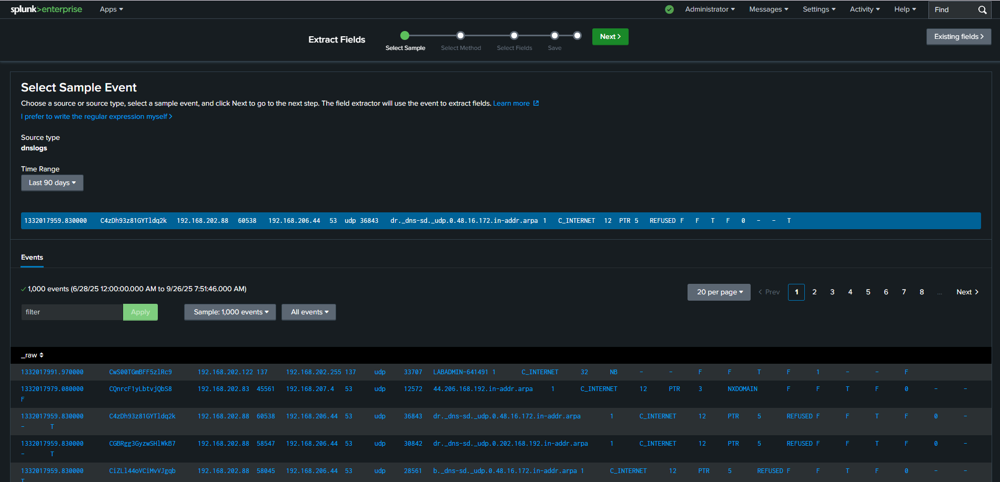
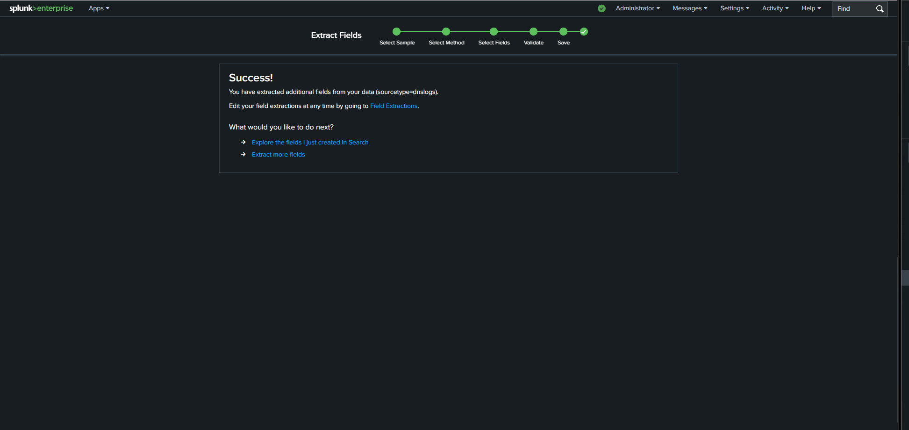
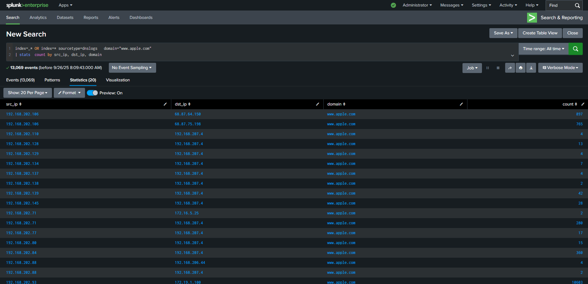
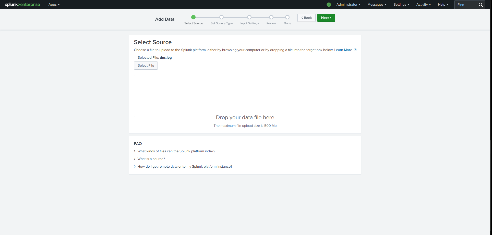
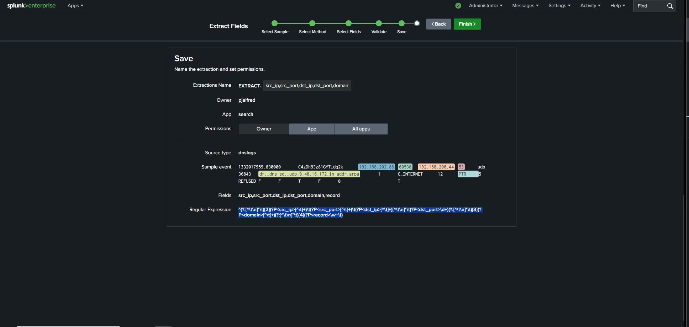
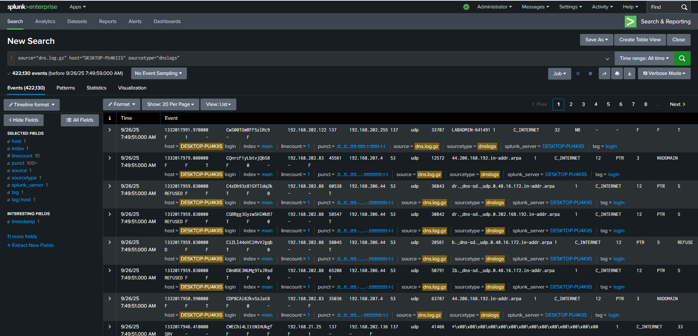
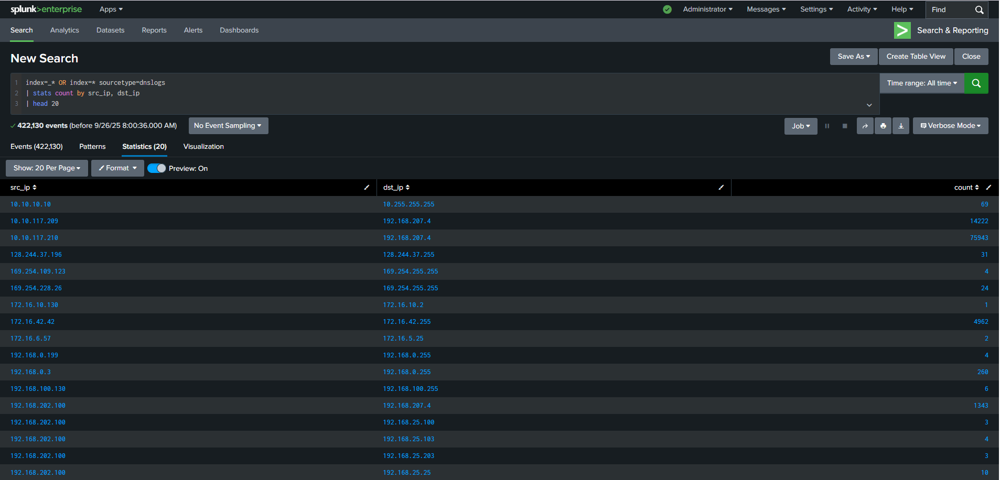
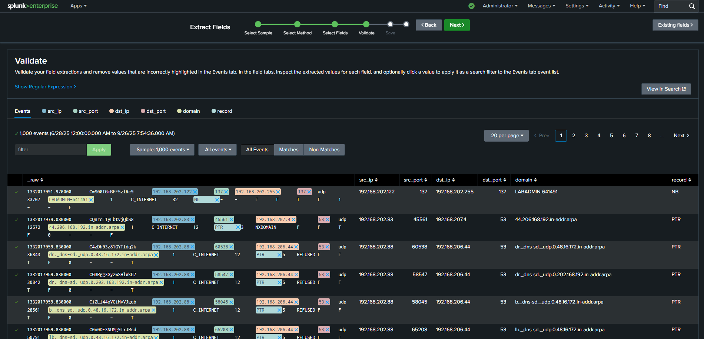

# DNS Log Analysis & Field Extraction

## Overview

Ingested and normalized DNS log data in Splunk to identify communication patterns and potential anomalies. Demonstrated custom field extraction, data transformation, and SPL query development for structured analysis of unstructured log data.

## Scenario

Raw DNS logs required parsing and transformation into a structured format for analysis. Built custom field extractions to identify source IPs, destination IPs, domains, and ports, then used SPL queries to aggregate and visualize DNS communication patterns.

## Tools Used

- **Splunk Enterprise** - Log ingestion and analysis platform
- **SPL (Search Processing Language)** - Query development
- **Custom Field Extraction** - Data normalization

## Implementation Process

### 1. Data Ingestion
- Uploaded DNS logs into Splunk via Add Data interface
- Defined sourcetype: `dnslogs`
- Configured initial parsing parameters

### 2. Field Extraction
Created custom field extractions for key DNS attributes:

**Extracted Fields:**
- `src_ip` - Source IP address initiating DNS query
- `dst_ip` - Destination DNS server
- `domain` - Queried domain name
- `ports` - Source and destination ports

**Why field extraction matters:**
- Raw logs are unstructured text
- Extracted fields enable filtering and aggregation
- Makes data searchable and analyzable
- Foundation for correlation and pattern detection

### 3. SPL Query Development

**Basic Domain Query:**
```spl
index=* sourcetype=dnslogs domain="www.apple.com"
| stats count by src_ip, dst_ip, domain
```

**Communication Pattern Analysis:**
```spl
index=* sourcetype=dnslogs
| stats count by src_ip, dst_ip, domain
| sort -count
| head 20
```

**Aggregation by Source:**
```spl
index=* sourcetype=dnslogs
| stats count as query_count, dc(domain) as unique_domains by src_ip
| sort -query_count
```

### 4. Data Visualization
Used Splunk Statistics view to display parsed data:
- Transformed raw events into structured tables
- Clear visualization of IP-to-IP communication
- Domain query frequency analysis
- Pattern identification for anomaly detection

## Key Results

✅ Successfully ingested and parsed DNS logs  
✅ Created custom field extractions for analysis  
✅ Built SPL queries for pattern identification  
✅ Transformed unstructured logs into structured data  
✅ Enabled communication pattern analysis  
✅ Demonstrated data normalization skills  

## Technical Skills Demonstrated

✅ Splunk data ingestion and sourcetype configuration  
✅ Custom field extraction from unstructured logs  
✅ SPL query development for aggregation  
✅ `stats` function for grouping and counting  
✅ Data transformation and normalization  
✅ Pattern analysis and visualization  
✅ Log parsing methodology  

## SPL Techniques Used

**stats Command:**
```spl
| stats count by src_ip, dst_ip, domain
```
Groups events and counts occurrences - essential for pattern analysis

**Filtering:**
```spl
domain="www.apple.com"
```
Narrows results to specific domains of interest

**Sorting:**
```spl
| sort -count
```
Orders results by frequency (descending)

**Field Selection:**
```spl
| table src_ip, dst_ip, domain, count
```
Displays only relevant fields in clean format

## Use Cases for DNS Log Analysis

**Security Applications:**
- **DGA Detection** - Identify algorithmically generated domains (malware C2)
- **Data Exfiltration** - Detect DNS tunneling attempts
- **Threat Hunting** - Find anomalous query patterns
- **IOC Matching** - Search for known malicious domains
- **Baseline Analysis** - Understand normal DNS behavior

**This Lab Demonstrates:**
- Foundation for advanced DNS threat detection
- Data preparation for anomaly detection
- Communication pattern baseline establishment

## Data Transformation Impact

**Before Field Extraction:**
```
Raw log: 192.168.1.10 -> 8.8.8.8 query www.example.com
```
Unsearchable, difficult to analyze

**After Field Extraction:**
```
src_ip="192.168.1.10"
dst_ip="8.8.8.8"
domain="www.example.com"
```
Searchable, aggregatable, analyzable

**Result:** Transformed unstructured text into structured, queryable data

## Operational Value

**Why DNS Log Analysis Matters:**
- DNS is a critical indicator of compromise
- Most malware uses DNS for C2 communication
- Data exfiltration often uses DNS tunneling
- Anomalous patterns indicate threats
- Baseline understanding enables detection

**Capabilities Enabled:**
- Query filtering by domain, IP, or pattern
- Aggregation by communication pairs
- Frequency analysis for anomaly detection
- Foundation for advanced threat hunting

## Lessons Learned

- **Field extraction is foundational** - Can't analyze what you can't parse
- **Sourcetype configuration matters** - Proper setup enables consistent parsing
- **stats is powerful** - Aggregation reveals patterns invisible in raw logs
- **Structured data enables correlation** - Parsed fields can be joined with other datasets
- **Visualization accelerates analysis** - Tables make patterns obvious

## Future Enhancements

**Advanced DNS Detection:**
- DGA domain detection using entropy analysis
- DNS tunneling detection via query length/frequency
- Threat intelligence integration for IOC matching
- Baseline deviation alerts for anomalous patterns
- Automated field extraction for new log formats

---

**Analysis Date:** 2025 (Lab Environment)  
**Platform:** Splunk Enterprise  
**Query Language:** SPL  
**Analyst:** Paige Alfred
```
---

## Lab Screenshots

### DNS Query Analysis


*SPL query analyzing DNS traffic for www.apple.com domain - 13,069 events*

### Field Extraction Success


*Successfully extracted additional fields from DNS log data*

### Field Extraction Save


*Saving custom field extraction configuration for dnslogs sourcetype*

### DNS Log Upload


*Uploading DNS logs into Splunk via Add Data interface*

### Select Sample Event


*Selecting sample event for custom field extraction from DNS logs*

### DNS Communication Patterns


*Structured view of DNS communication patterns showing source IPs, destination IPs, and query counts*

### Raw DNS Events


*Raw DNS log events showing 422,130 events processed*

### Field Validation


*Validating extracted fields: src_ip, dst_ip, domain, ports*
